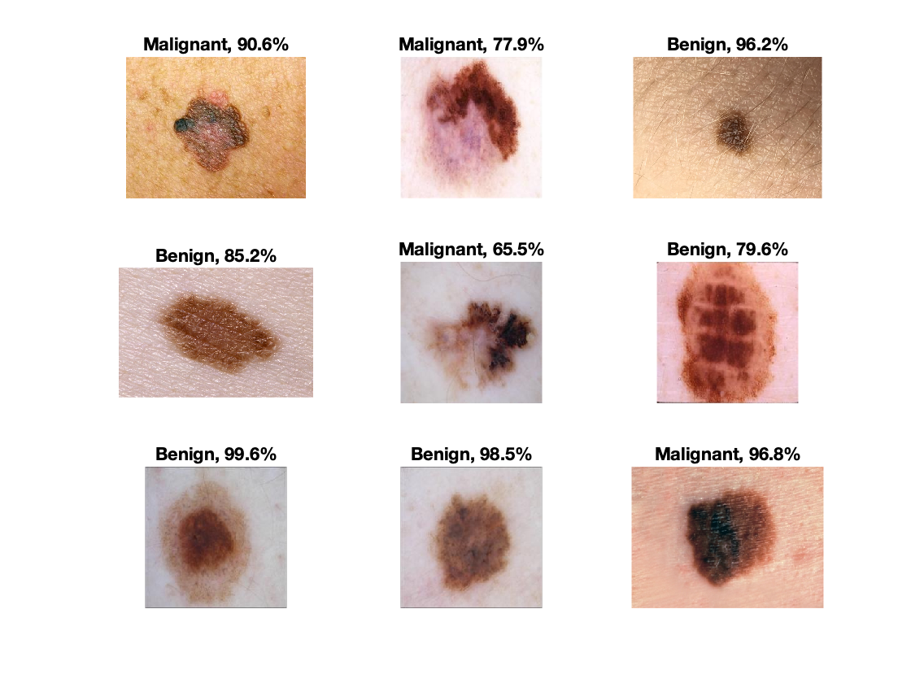

# MATLAB_ML
Machine learning projects developed in MATLAB.

# melanomaNet

Instructions

1. Download 'melanomaNet' and launch MATLAB.
2. Unzip "images_compressed.zip" in "Combined" folder
3. Go to the 'Combined' folder and run the file 'NeuralNetMelanomaUser.m'from that location to train AlexNet to classify melanoma images into benign/malignant.
4. In MATLAB, open the 'Pictures', and run the file 'DisplayMelanomaNet.m' from that location.
5. Go back to 'melanomaNet' and run 'MelanomaNetDeepDream.m' file.

*Requirements: AlexNet pre-trained MATLAB add-on module

   
